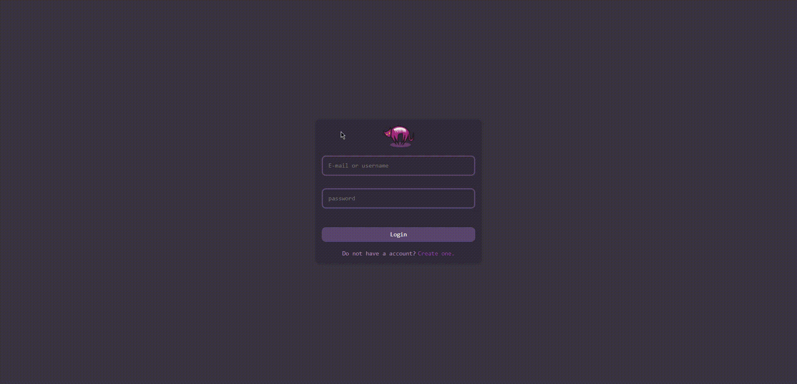

# ChatProject

Um chat em tempo real utilizando de WebSockets dividido em 4 serviços e sendo consumidos por uma API Gateway da AWS. Utilizando 2 liguagens de back-end NodeJS e Java, com as bibliotecas ExpressJS e Spring Boot.

Melhorias que eu faria se fosse colocar o projeto em produção:
1. Encripitografar todos dados privados do payload do JWT.
2. Geração automatica da chave publica e privada que assina o JWT ao lançar o servidor (Feito na versão da AuthAPI em java).
3. Melhoraria e iria restringir a configuração do Cors.
4. Animações e tela de carregamento no app React.
6. Organizaria os arquivos do app React (Talvez enquando vc estiver lendo isso, eu ja tenha organizado).
7. Adicionaria sistema de troca de chaves privadas Diffie Helman and Elgamal (Muito complexo porém extremamente nescessario em um app de Chat).
8. Colocaria opção do usuario colocar uma foto personalizada utilizando AWS S3 e armazenaria o url no banco de dados.

Tecnologias & bibliotecas utilizadas: 
* JWT
* RSA
* MySQL
* WebSockets
* Express
* Spring Boot
* uuid
* Cors
* React
* NodeJS
* Java
* LocalStorage
* IndexedDB
